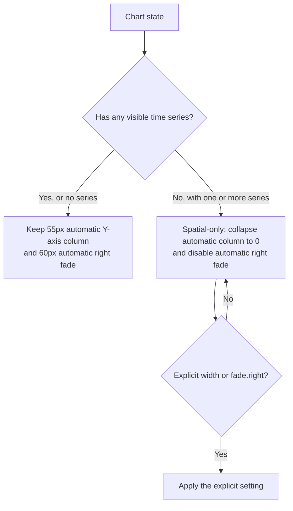

# Summary — Stop the edge fade masking pie and heatmap charts

The change is complete and approved: pie- and heatmap-only charts no longer receive the automatic right-edge erase mask or an unused 55-pixel Y-axis column, and the focused scenarios, type check, formatting check, API checks, and affected renderer tests pass.

## Why this changed

The automatic right-edge fade was intended for time-series content sliding under a Y-axis column. It was also applied to spatial-only charts, where it could partially erase pie labels and leader lines at the right edge even though those charts have no time axis or useful Y-axis gutter.

## What changed

`ChartInstance` now treats a populated chart with no visible time series as spatial-only. In that state it automatically collapses the default Y-axis width to zero and disables only the automatic right fade. It resynchronizes scales and redraws when adding, removing, or hiding a series changes that state. Explicit settings still take precedence: a caller can reserve a Y-axis width or request `fade.right` for a spatial-only chart. Empty charts retain the existing automatic column and fade.

The trade-off is intentional: mixed charts keep the column and fade because their visible time series needs that axis geometry, so a pie sharing such a chart may still fade at its right edge. Per-series fade behavior was not added. Documentation and the generated API manifest now describe the automatic spatial-only behavior and explicit overrides.

## Human decisions

The owner chose the broader `collapse-column` scope rather than the initially recommended fade-only fix. This recentres and enlarges existing pie and heatmap charts by removing their default empty 55-pixel gutter; it is a deliberate layout change. The implementation keeps explicit axis widths and fades available for callers that need the old geometry.

## Verification

All six declared acceptance scenarios passed individually: pie-only and heatmap-only charts clear the automatic mask and column; time-series, mixed, and empty charts retain the default mask; and an explicit right fade still works on a pie-only chart. The integration suite has 26 passing tests, including the transition where hiding the last time series collapses the column and drops the mask. Related spatial-scroll and pie-renderer suites passed 110 tests. TypeScript, Biome, API-manifest extraction, and React/Vue/Svelte API-parity checks were clean.

The full Vitest run reported 1,889 passing and 4 failing tests. The failures are all in the pre-existing, environment-specific `docs/__tests__/useSettings.test.ts` `localStorage.clear()` setup and are unrelated to this change. The repository metadata was unavailable in the workspace, so verification could not produce a Git diff against `main`; the current files and supplied product-code diff were reviewed directly.

## Review first / not done

Review `packages/core/src/chart.ts` first for the spatial-only predicate, width synchronization, and right-fade geometry; then review `packages/react/src/__tests__/integration/top-fade.test.tsx` for the behavior at 800×400. The review verdict is approve.

One non-blocking documentation follow-up remains: `proposal.md` still says the pie-only pane clip is “745 wide, not 757,” which belongs to the superseded fade-only scope. The implemented and tested owner-selected behavior is a zero-pixel Y-axis column and an 800-pixel chart area. The proposal should be updated to say “800 wide, not 757” or to assert the zero-width column instead. No product behavior remains deferred.
